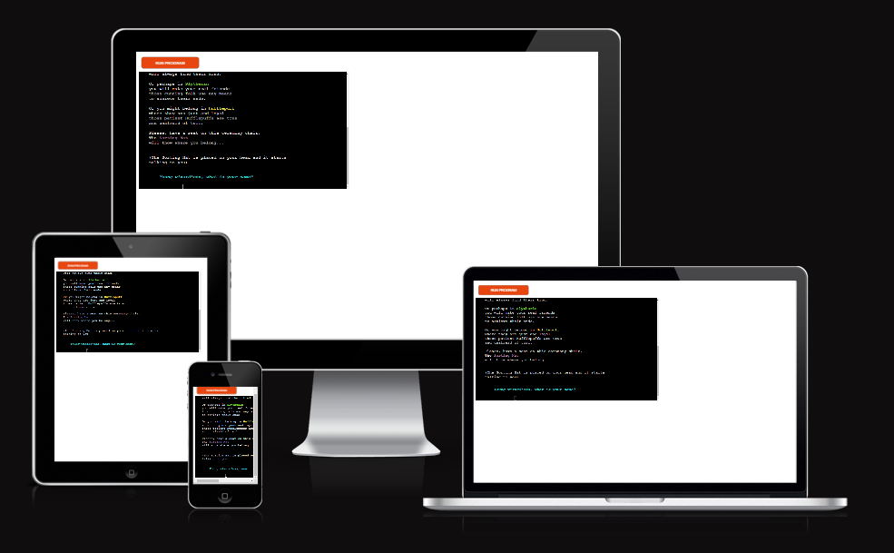
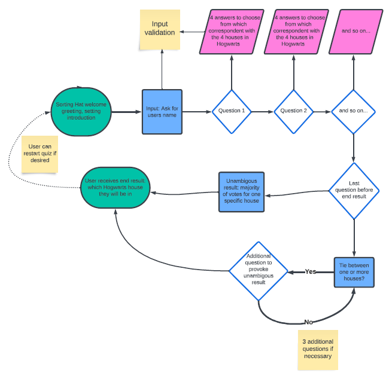
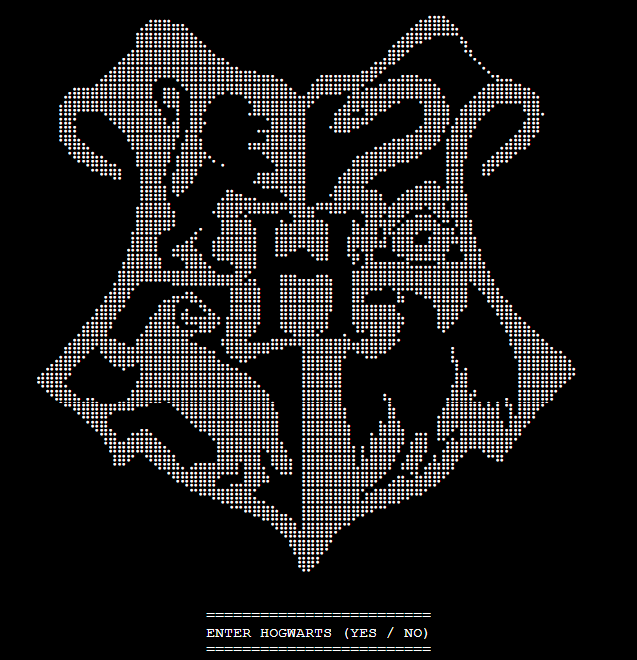
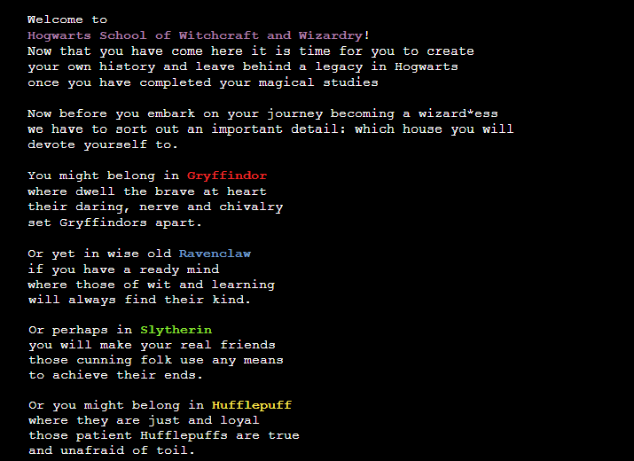
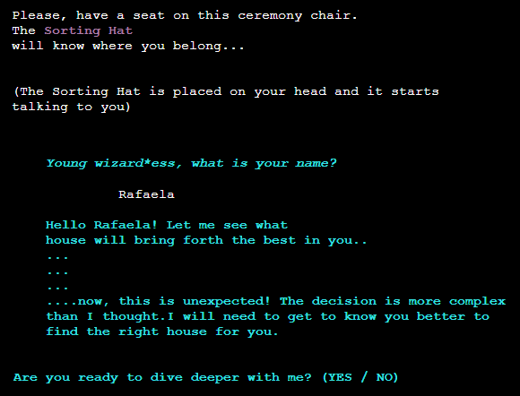
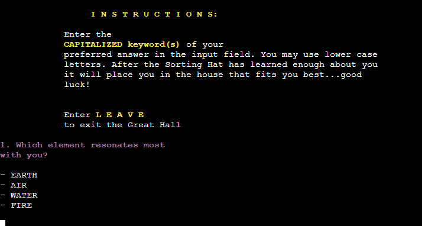
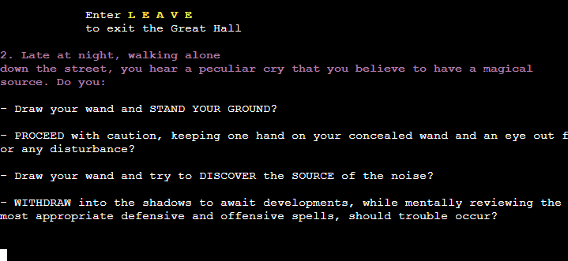
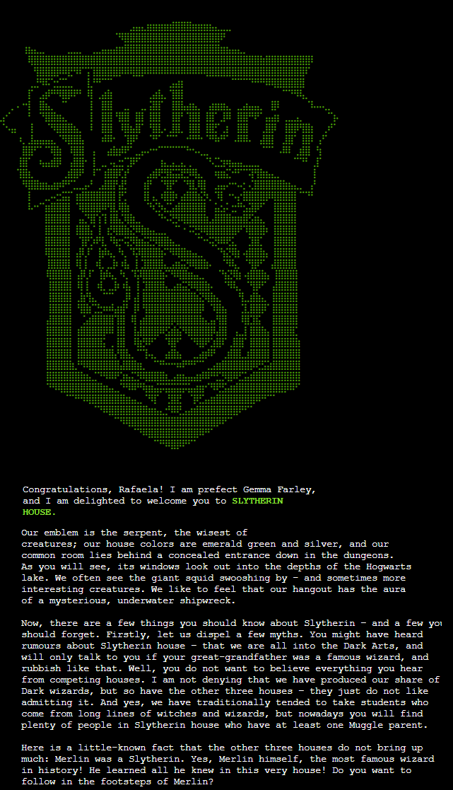
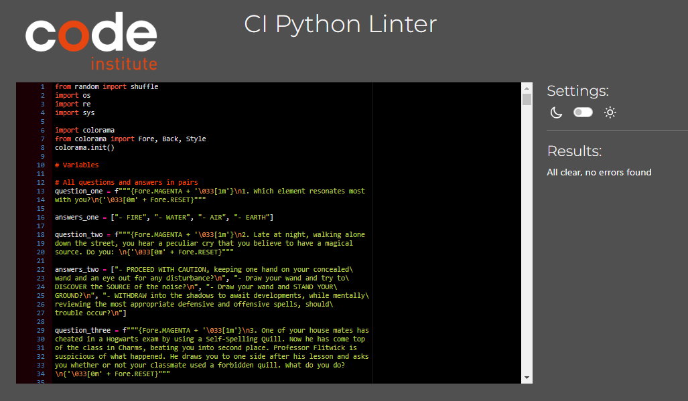

# Code Institute: Python Project by Rafaela Wetzel

The third milestone project is about creating a Python command-line application and showcasing the Python skills I have attained over the past 5 weeks at Code Institute. It is deployed on a Code Institute mock terminal on Heroku and the third out of five projects.  

# Sorting Hat

For my Sorting Hat project I am creating a quiz-like application that imitates the house sorting process in the story of Harry Potter. When he and his friends come to the wizarding school Hogwarts for the first time there is a welcome celebration in the Great Hall that involves a sorting ceremony. There are four houses in Hogwarts: Gryffindor, Slytherin, Ravenclaw and Hufflepuff. Depending on the students character and intentions they are being placed in one of the houses by a magical, speaking Sorting Hat. Every student is called onstage individually and puts the Sorting Hat onto their head. For some students the Sorting Hat shouts out the house to the crowd after just a moment; for others the Sorting Hat speaks to them so only the two of them can hear, and shares its thought process about the house placement. 

In my application the user is the student that is coming to Hogwarts for the first time. They are being welcomed to the school and approach the sorting process. The Sorting Hat then speaks to them and says that the decision is not easy and that it needs more information about them to be able to make a decision. The quiz then starts and asks 15-20 questions that evaluate the user and places them into one of the houses depending on their answers. The questions are not about asking for specific knowledge but are aimed at analyzing the users character, values and fictional decisions. 

I chose to create this application because the story of Harry Potter had been a big part of my childhood so this project can be seen as a hommage to these novels and the phase of life it is associated with. I also wanted to create a different project than the most common ideas suggested for Python beginners. 

# Table of Contents

- [Code Institute: Python Project by Rafaela Wetzel](#)
- [Sorting Hat](#sorting-hat)
- [Table of Contents](#table-of-contents)
- [Live Demo](#live-demo)
- [How to Play](#how-to-play)
- [Flowchart](#flowchart)
- [Technologies](#technologies)
- [Libraries](#libraries)
- [Features](#features)
  - [Start Section](#start-section)
  - [Welcome Section](#welcome-section)
  - [Sorting Ceremony Section](#sorting-ceremony-section)
  - [Question Section](#question-section)
  - [House Result Section](#house-result-section)
- [Features Left to Implement](#features-left-to-implement)
- [Testing](#testing)
  - [Testing App Functions](#testing-homepage-functions)
  - [Validator Testing](#validator-testing)
  - [Bugs & Problems](#bugs--problems)
  - [Unfixed Bugs](#unfixed-bugs)
- [Deployment](#deployment)
- [Credits](#credits)
  - [Tutorials](#tutorials)
  - [Media](#media)
  - [Acknowledgements](#acknowledgements)

# Live Demo 

  
  
**You can see a deployed version of my app [here](https://magical-sorting-hat-d52437409b26.herokuapp.com/)**

# How to Play  

The user starts on the main page that shows the Hogwarts Coat of Arms and enters the school by typing 'yes'. There is a short introduction about the procedure and the characteristics of the four houses. The Sorting Hat is put on the users head to determine which house they should attend. It asks for their name and says that the decision is more difficult than expected; that it needs to get to know them better to be able to sort them into a house. The user then can enter 'yes' to start the display of questions. For each question there are 4 - 6 answers the user can choose from. They need to enter their chosen answer in the input field and are forewarded to the next question. After 15 questions the house scores are evaluated for the first time. If there is a clear winner (a house that has received the most answers) the user will be forwarded and shown the winning houses' Coat of Arms as well as a 'Welcome to the House'-text. If there is a tie between two or more houses after question 15 it continues to question 16, 17, ... and 20 at last. In the unlikely case that the user ends up with the 20th question and there is still a tie they can choose which house they would like to belong to.

# Flowchart

# Technologies

- Python for creating the Sorting Hat quiz code
- Heroku for deployment in a mock terminal

# Libraries

I used the following libraries:

- *from random import shuffle* to shuffle the question answers so that the answers are not displayed in the same order as put in the variables (Gryffindor, Slytherin, Ravenclaw, Hufflepuff)

- *import os* to clear the console after a house wins or the user leaves the game early

- *import re* for input validation using regular expressions

- *import sys* to block the print function in the very last question because the print statement is not needed there anymore

- *import colorama* to add colors to the terminal 

# Features 

## Start Section  

The first thing the user sees when opening the app is the Hogwarts Coat of Arms and an option that asks them if they want to enter Hogwarts or not ('yes / no'). When selecting 'no' the following message is displayed: 

*"You just missed your chance to become a great wizard*ess... *Press any key to take the Hogwarts Express back to London".* Pressing any key will delete this message and show the Coat of Arms again.  

When entering nothing or something else than 'yes' or 'no' the following message is shown: *"Only yes or no answers are valid. Press any key to return"* and the same happens as described above. 

## Welcome Section  

By choosing the 'yes' option the user is greeted with a welcome text of the school mentioning that a house must be selected for the user to be placed in. After this the four houses are presented with a short text each: Gryffindor, Slytherin, Ravenclaw and Hufflepuff. 

## Sorting Ceremony Section

The user is asked to sit down on the ceremony chair to get the Sorting Hat placed on their hat which will decide on the house placement. The user is asked by the talking Sorting Hat to enter their name. If the user enters nothing or something else than letters the following message is displayed: *"Please enter a string that consists of letters a-z or A-Z".* The next step is that the user is greeted by the Hat with their individual name. It is telling them that the selection procedure is more difficult than expected and that the Hat needs more time to get to know the user to decide which house they will be placed in. The user then has the option to enter that they are ready to go on or that they are not. Entering that they are not ready will display: *"Maybe this is not yet the right time for you to discover the world of wizardry. I might see you again in a couple of years...Press any key to take the Hogwarts Express back to London."* Pressing any key will bring them back to the start section. When the user enters empty oder invalid data it says *"Only yes or no answers are valid."* 

## Question Section

The Question section begins with a short instruction of the game. Each of the 4-6 given answers for every question contains a *capitalized keyword* that needs to be entered in the input field depending on which answer the user chooses. After the Sorting Hat has learned enough about the user it will place them in one of the houses.

While answering the questions there is always the option to exit the game by entering *leave*. A text is then displayed saying that the user is trying to sneak away from the ceremony but is being discovered by a teacher who casts a Memory Charm that makes the user forget. They are suddenly relocated at Kings Cross Station in London, having forgotten everything and wondering about the odd platform number 9¾. The user then can press enter to see the Start section again. 

If the user chooses to play they have to answer at least 15 questions by typing in the capitalized keyword(s) that correlates with one of the four houses each. For every answer one point is assigned to the respective house score. If there is a clear winner after 15 questions the user will be forwarded to the Result section which is the placement in one of the four houses. If there is a tie between one or more houses after 15 questions there are additional questions no. 16-20. As long as there is a tie the console will display "Mmmmmhhhhh..... it is not an easy decision. I need more time to figure it out..." and move on to the next question. Invalid input is handled by the message "Please enter one of the capitalized keyword(s)".

After each of the questions no. 16-20 the scores are checked until there is a house with a majority of points. In the very unlikely case that there should still be a tie after 19 questions the user can choose their preferred house at last.    

## House Result Section

Depending on the winning house the user is forwarded to the matching Result section. It shows the houses Coat of Arms in its house color (red, green, blue, yellow) and a welcome text by the houses prefect where the user is congratulated with their entered name. The text contains some information and funny anecdotes about the house. The user can then press any key to return to the Start section.  

# Features Left to Implement

- A continuation of the quiz could be that the user would be able to take another quiz with questions specific to their winning house. This would be a quiz to test their Harry Potter knowledge instead of a 'personality quiz'. 

# Testing 

## Testing App Functions  

- I confirm that 

- I confirm that

- I confirm that

- I confirm that

- I confirm that

- I confirm that

- I confirm that

- I confirm that

## Validator Testing

- I confirm that no errors were returned when passing through the CI Python Linter [pep8ci](https://pep8ci.herokuapp.com/).

## Bugs & Problems

- When a user input would be checked within the increase_score function the score for the respective house was supposed to increase by 1. When the scores for all houses were printed after this step to double check if everything works correctly it would show an increase by 2 instead of 1 for the respective house. It took me a while to figure out that this was due to the step that comes straight after this: running the increase_score function again to see if the user input was valid (point gained = True) or invalid (no point gained = False) by checking for the returned value that would trigger the next question (True) or repeat the current one (False). In the process of running the increase_function a second time, even if it was only to check for a True or False return value, the respective house score would be increased by 1 for the second time so that the outcome would be 2 points instead of 1. My solution was to separate the increase_score function from the valid/invalid input check by creating a second function check_if_true. The latter would then only have the purpose to return either a True or False value and not increase any score.    

- In the check if true function I first wrote: "if input in gryffindor_answers or slytherin_answers or ravenclaw_answers or hufflepuff_answers: return True" and was wondering why it did not work but skipped to the next question even if the answer was wrong. Later I realized that I would have to put "input in" before each of the houses, not only in the beginning.

## Unfixed Bugs

No unfixed bugs.

# Deployment

1. Add requirements for deployment in requirements.txt file
2. Log in to Heroku and create new app
3. Add Python and Nodejs Buildpacks
4. Go to deployment section and connect to GitHub account
5. Search for project repository and connect to Heroku
6. Deploy branch via manual deploy

The live project can be found here: https://magical-sorting-hat-d52437409b26.herokuapp.com/ 

# Credits 

- House descriptions by [wizardingworld.com](https://www.wizardingworld.com/news/discover-your-hogwarts-house-on-wizarding-world)

- Quiz questions by [wizardmore.com](https://wizardmore.com/sorting-hat-x/) and [buzzfeed.com](https://www.buzzfeed.com/perpetua/lazy-harry-potter-hogwarts-sorting-hat-quiz)

- House welcome texts taken from [harry-potter.fandom.com](https://harry-potter.fandom.com/de/wiki/Kategorie:Begriffskl%C3%A4rung?from=B)

## Tutorials 

[1] How to clear the console
https://www.youtube.com/watch?v=VAStmLsFQZ8

[2] How to add input validation
https://www.copahost.com/blog/input-python/#:~:text=Input%20validation%20using%20the%20module,print(%22Entry%20is%20valid!

[3] How to add Colorama
https://www.youtube.com/watch?v=u51Zjlnui4Y 

[4] How to block calls to print
https://stackoverflow.com/questions/8391411/how-to-block-calls-to-print 

## Media

- ASCII art by [emojicombos.com](https://emojicombos.com/harry-potter-ascii-art)

## Acknowledgements

- Help and feedback from my mentor Oluwafemi Medale